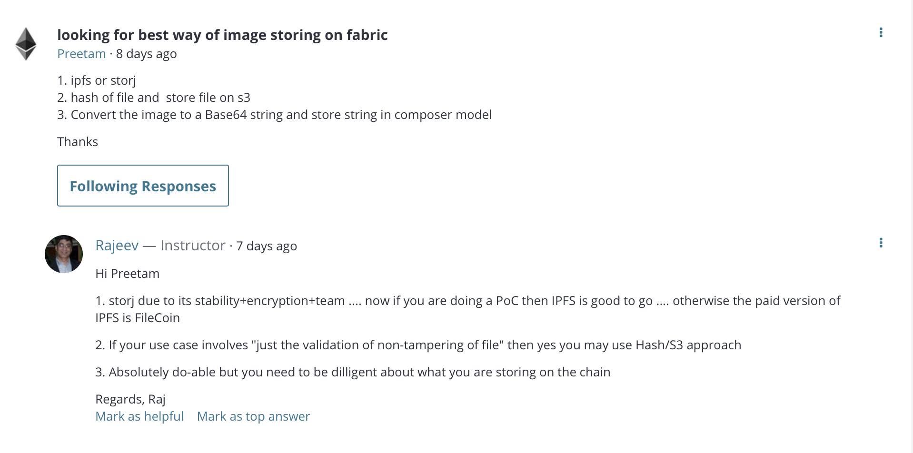
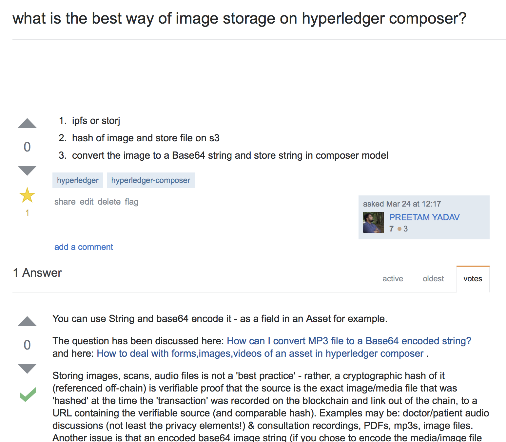

# Screenshots





# composer-storage-ways

Test environment and random stuff for hyperledger fabric and composer

## Prerequisites
  - Install following as a global variable
  - Install `composer-cli`
  - Install `composer-rest-server`
  - `npm install -g <aboveStuff>`

## 1. Setup Fabric for the first time

These commands will kill and remove all running containers, and should remove all previously created Hyperledger Fabric chaincode images: Use only if you want to remove all data and get a HARD RESET.

- Removes all docker instances, cleans images, causes you to lose all data stored on docker
- If other applications are using docker, better to remove the fabric related containers individually.
```
docker kill $(docker ps -q)
docker rm $(docker ps -aq)
docker rmi $(docker images dev-* -q)
```

- Remove all current composer cards
```
composer card list
composer card delete -n <card_name>
```

- Run fabric for the first time. Creates a PeerAdmin card that is used for all instances of chain-code. Also
removes all your current data, cards etc

All the scripts will be in the directory `/fabric-tools`.
```
cd ~/fabric-tools
./stopFabric.sh
./teardownFabric.sh
./downloadFabric.sh
./startFabric.sh
./createPeerAdminCard.sh
```

- Confirm that fabric has started
`docker ps` will show 4 containers running

- Confirm a PeerAdmin card has been created

`composer card list` should show `PeerAdmin@hlfv1` with no business network assigned

- Initial Setup is complete. Time to launch a chain code instance


## 2. Launch a business network/ chaincode instance

- Generate the Business Network Archive (BNA) file from the root directory:
```
composer archive create -t dir -n .
```

- Successfully created a file called `composer-file-stroage-ways@0.1.0.bna` in root directory

- Install the runtime instance for the .bna file. This HAS to use the PeerAdmin@hlfv1 card
```
composer runtime install --card PeerAdmin@hlfv1 --businessNetworkName composer-file-stroage-ways
```

- Start a network and create a new networkAdmin card for the business network
```
composer network start --card PeerAdmin@hlfv1 --networkAdmin admin --networkAdminEnrollSecret adminpw --archiveFile composer-file-stroage-ways@0.1.0.bna --file networkadmin.card
```

- Import the new networkadmin.card generated
```
composer card import --file networkadmin.card
```

- A card `admin@composer-file-stroage-ways` should be visible with `composer-file-stroage-ways` as network assigned
```
composer card list
```

- Activate the card by setting the certificate
```
composer network ping --card admin@composer-file-stroage-ways
```

- To remove everything and start from scratch, follow step 1

## 3. Close fabric safely and save its state
- Go to the folder containing the `docker-composer.yaml` file
```
cd ~/fabric-tools/fabric-scrips/hlfv1
docker-compose stop
```

## 4. Restart a previously deployed network
```
cd ~/fabric-tools/fabric-scrips/hlfv1/composer
docker-compose start
```
- Takes a few minutes to start. `docker ps` should show 5-6 containers running

- To update an instance with new chaincode we use

https://hyperledger.github.io/composer/reference/composer.network.update.html

`composer network update -a composer-file-stroage-ways@0.1.0.bna -c admin@composer-file-stroage-ways`

## 5. Other useful commands

### Card commands
Option feature is to delete existing cards. Network and System admin cards should not be removed unless a hard reset is reuired

```
composer card list
composer card list --name <cardName>
composer card delete -n <cardName>
```

### API endpoint lists

#### User add API

- Create a new user (Base64 string way)

`/api/v0/users`

#### Drug Assets API (ipfs way)

- Create a new drug (POST)

`/api/v0/assets`

#### Drug Assets API (off-chain external cloud storage way)

// pending
